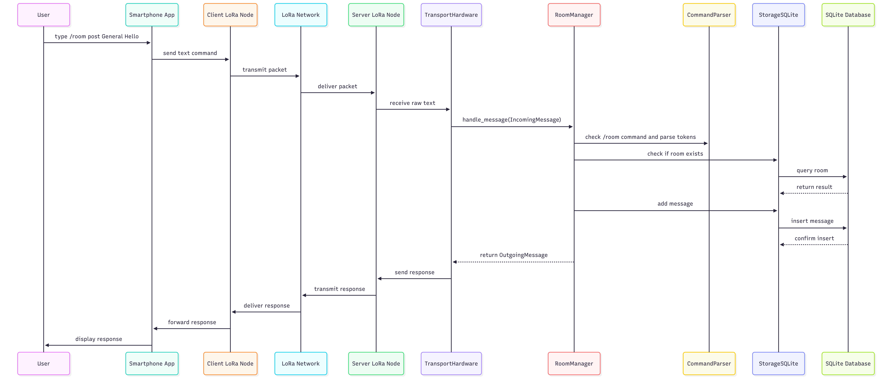

# Technical Architecture & Design Choices

---

## 1. Global Architecture

The system follows a modular architecture to separate communication logic from business logic.

### Hardware Setup

[ Raspberry Pi ] <--(USB Serial)--> [ LoRa Module ] <~~(Radio)~~> [ Client Nodes ]

### Detailed Software Architecture

The source code is organized into several modules located in the `Src/` directory.
Each module has a well-defined responsibility in the overall architecture.
Here is the technical description of each Python module composing the **Room Server LoRa** project:


| File / Module               | Main Role                            | Technical Description                                                                                                                                                                                |
| :-------------------------- | :----------------------------------- |:-----------------------------------------------------------------------------------------------------------------------------------------------------------------------------------------------------|
| **`main.py`**               | **Entry Point (Orchestrator)**       | This is the file executed to start the server. It initializes the database, the`RoomManager`, and connects the hardware.                                                                             |
| **`database.py`**           | **Data Management (Storage)**        | Manages the **SQLite** connection. It creates the tables (`rooms`, `messages`) and contains functions to insert or read data (CRUD).                                                                 |
| **`room_manager.py`**       | **Business Logic (Brain)**           | **Central module** of the server. It processes incoming commands, manages rooms, applies anti-spam protection, formats long replies, and coordinates all interactions with the SQLite storage layer. |
| **`parser.py`**             | **Syntax Parser (Translator)**       | Parses `/room` commands, extracts tokens, and helps the server distinguish actions and arguments before execution.                                                     |
| **`meshtastic_comm_hw.py`** | **Hardware Interface (Real Driver)** | This is the Wio-E5 "driver". It listens to the USB port (`/dev/ttyUSB0`), captures incoming LoRa signals, and sends responses.                                                                       |
| **`meshtastic_comm.py`**    | **Simulation Interface (Mock)**      | Simulates the LoRa interface via the console. Allows testing the entire server logic without connected hardware, using the keyboard as input and screen as output.                                   |
| **`client.py`**             | **Client Simulator (Tester)**        | The script used on the test computer. It allows sending messages to the server via a second LoRa module, simulating a real user.                                                                     |
| **`reset_db.py`**           | **Maintenance Tool (Cleaner)**       | A small utility script to cleanly delete the`.db` file and reset the database to zero in case of problems.                                                                                           |
| **`logger.py`**             | **Logging (Tracker)**                | Provides logging support across the application for debugging, monitoring, warnings, and error tracking.                                               |


### How they interact (Data Flow)

To illustrate the system operation, here is the logical flow of a command (example: creating a room) through the different modules:

1. **`meshtastic_comm_hw.py`** receives a radio signal 📡 ➔ Transmits raw text to the system.
2. **`parser.py`** analyzes the text 🧐 ➔ Determines: "It is a `/room create` command".
3. **`room_manager.py`** receives the order 🧠 ➔ Decides: "I must create a room".
4. **`database.py`** executes the order 💾 ➔ Writes: "Room created in SQL table".
5. **`room_manager.py`** prepares the response ✅ ➔ Generates the text: "OK, room created".
6. **`meshtastic_comm_hw.py`** sends the response back via radio 📡 ➔ Emits the signal to the user.

---

## 2. Data Persistence Strategy

We selected **SQLite** as our storage engine.

* **Justification:** unlike a flat JSON file, SQLite supports atomic transactions. This is crucial for the "Brutal Shutdown" requirement. If power is lost during a write operation, the database file is less likely to be corrupted compared to a text file.
* **Schema:**
  * `rooms` (id, name, description, created_at)
  * `messages` (id, room_id, sender_node_id, timestamp, content)

---

## 3. Sequence Diagram



The following sequence diagram illustrates the complete lifecycle of a `/room post` command,
from the user smartphone to the LoRa network, then to the Room Server,
and finally back to the client after database processing.

**Scenario: Posting a Message**

1. **User** sends `/room post General Hello`.
2. **Comm Layer** receives packet -> extracts text.
3. **Parser** identifies command `post`, target `General`.
4. **Controller** checks if `General` exists.
5. **DB** inserts message record.
6. **Comm Layer** sends acknowledgment "Message Saved".

---

## 4. Network Optimization: Direct Message (DM) Responses

When using the server, you will notice that if you send a command (e.g., **/room list** or **/room read**) in the project's public channel, the server does not reply in that same public channel. Instead, it opens a **private conversation** (Direct Message) with your device.

### Why this technical choice?

* **Bandwidth Efficiency (Duty Cycle):** The LoRa network is subject to strict bandwidth constraints. If the server were to broadcast full lists or message histories in the public channel, it would monopolize the antenna and spam the screens of all users.
* **User Experience (UX):** Each client node receives its requested data in an isolated, private manner. This significantly improves readability on small displays such as OLED screens and mobile devices

### Server Identity Configuration

By default, the Wio-E5 module identifies itself on the network with a generic name based on its hardware address.

To make the interface more intuitive for end-users, we renamed the server node to appear clearly as the **"Room Server"**. This configuration is applied using the **Meshtastic CLI** on the Raspberry Pi:

```bash
meshtastic --set-owner "Room Server" --set-owner-short "SRV"
```

## 5. Limitations and Optimizations (LoRa Constraints)

* **Bandwidth Management:** Due to strict airtime rules (*LoRa Duty Cycle*) and low throughput, the \`read\` command is intentionally limited to return only 1 to 10 messages at a time to prevent network saturation.
* **Latency:** Asynchronous response times can vary between 2 and 30 seconds depending on network congestion and the number of radio hops required.
* **Message Size (32-character Chunking):** While the theoretical maximum payload of a Meshtastic packet is approximately 200 bytes, the server is designed to systematically split long messages into blocks of **32 characters maximum**. This technical choice addresses two major challenges:
    1. *Reduction of "Time-on-Air" and Loss:* Short packets minimize radio transmission time, drastically reducing the risk of collisions and packet loss, making the system significantly more robust.
    2. *Optimized User Experience (UX):* The 32-character limit matches the ideal reading width for small hardware displays (e.g., Heltec OLED screens) and mobile devices, ensuring clean text without arbitrary word breaks in the middle of sentences.
* **Robustness:** The SQLite database can be configured in WAL (Write-Ahead Logging) mode to reduce data corruption risks in the event of an abrupt power failure or shutdown.

## 6. Anti-Spam Protection (Rate Limiting)

* **Spam Protection:** To prevent LoRa network saturation and potential misuse, the server implements a **per-user cooldown** mechanism. Each node must wait **10 seconds** between two \`/room\` commands.
* **Network Throughput Management:** This limitation prevents burst command transmission that could monopolize the antenna and disrupt communications for other users on the Meshtastic network.
* **User Feedback:** If a user attempts to send a command before the timer expires, the server rejects the request and returns an error message indicating the remaining cooldown time.

> **Example response:** "Error: Please wait 7 more seconds before sending another command." 

This mechanism ensures the **stability and reliability** of the server within a constrained radio environment like LoRa.
